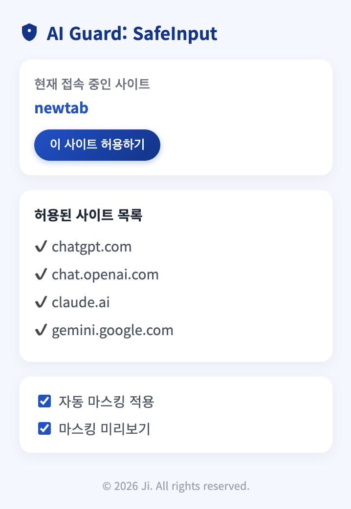
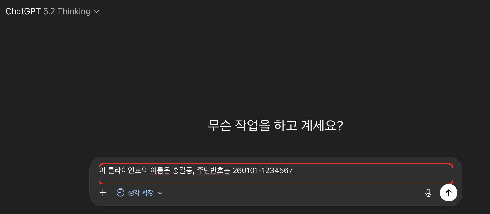
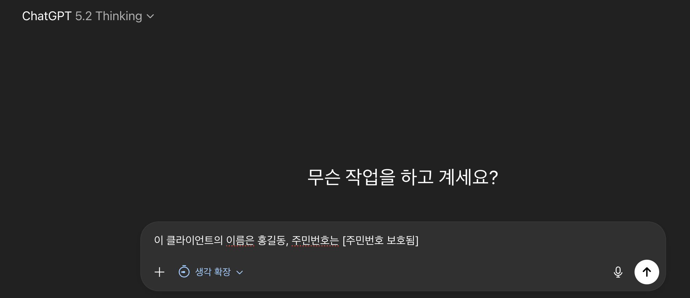

# PAI Guard (Prompt Injection & PII Guard) Project.

LLM 환경을 위한 실시간 개인정보 유출 방지 및 프롬프트 인젝션 방어 솔루션.

## Run the server (local)

```bash
# 1. 서버 폴더로 이동
cd server

# 2. 가상환경 생성 및 활성화 (macOS/Linux)
python -m venv .venv
source .venv/bin/activate

# (참고) Windows 사용자인 경우 아래 명령어로 활성화
# .\.venv\Scripts\activate

# 3. 필수 라이브러리 설치
pip install fastapi uvicorn

# 4. 서버 실행
uvicorn main:app --reload --host 127.0.0.1 --port 8000
```

Test the API:

```bash
curl -X POST http://127.0.0.1:8000/analyze \
  -H "Content-Type: application/json" \
  -d '{"text":"email test@example.com, phone 010-1234-5678"}'
```

## 프로젝트 소개

기업 내 생성형 AI(ChatGPT, Claude, Gemini 등) 활용이 증가함에 따라, 임직원의 부주의로 인한 개인정보 유출 및 외부의 프롬프트 인젝션 공격 위협이 대두되고 있습니다.

**PAI Guard** **(Prompt Injection & PII Guard)** 는 브라우저 단에서 사용자의 입력을 실시간으로 모니터링하고, 민감 정보가 외부 LLM 서버로 전송되기 전에 차단하거나 마스킹 처리하는 **엔드포인트 보안 프로토타입**입니다.

## 핵심 기능

1.  **실시간 개인정보(PII) 탐지 및 마스킹**
    - 전화번호, 이메일, 주민등록번호 등 민감 패턴을 정규표현식으로 탐지
    - 입력창에서 즉시 붉은색 경고 표시 및 안전한 문자로 치환 (예: `010-1234-5678` -> `[전화번호 보호됨]`)
2.  **프롬프트 인젝션 방어**
    - "이전 지시 무시해", "Ignore previous instructions" 등 우회 공격 패턴 탐지
    - 특수문자/띄어쓰기 변형 공격에 대응하는 정규화 로직 적용
3.  **사용자 친화적 보안 UI**
    - 확장 프로그램 팝업을 통한 On/Off 제어
    - 허용된 도메인 관리 및 자동 감지
    - 마스킹 결과 미리보기 기능

<div align="center">
  
  <p><em> [ 크롬 익스텐션 팝업 ] </em></p>
</div>
<div align="center">
   
  
  <p><em> [ 실시간 PII 탐지 경고(좌) 및 자동 마스킹 처리 결과(우) ]</em></p>
</div>

---

---

## 기술 스택

- **Frontend (Client)**: Chrome Extension, JavaScript, HTML/CSS
- **Backend (Server)**: Python, FastAPI, Uvicorn, Regex
- **Communication**: REST API

## Chrome extension 로드

1. Chrome 브라우저에서 chrome://extensions 접속
2. 우측 상단 "개발자 모드(Developer mode)" 켜기
3. "압축해제된 확장 프로그램을 로드합니다(Load unpacked)" 클릭
4. 프로젝트의 extension 폴더 선택

## 향후 발전 계획

- 관리자 대시보드 구축: 위협 탐지 로그 시각화 및 중앙 정책 배포 기능

- OCR 기능 통합: 이미지 내 포함된 개인정보 텍스트 추출 및 마스킹

- 엔터프라이즈 연동: 사내 LDAP/SSO 연동을 통한 사용자별 보안 정책 차등 적용

- 비즈니스 시너지: 기존 DRM 및 데이터 보안 솔루션 연동 및 차세대 보안 체계 구축

---

---

_Developed by Ji | Targeted for Secure AI Transformation_

---

---
